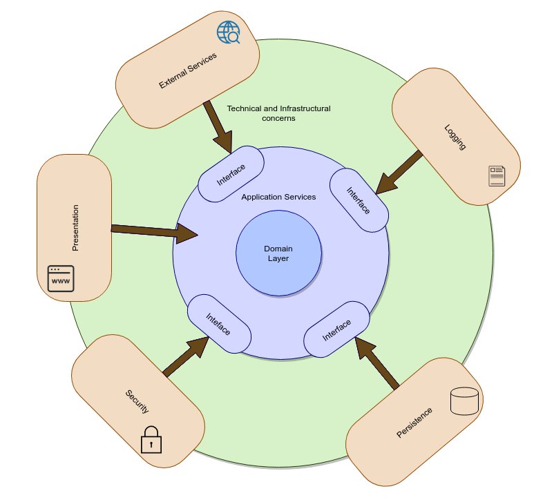
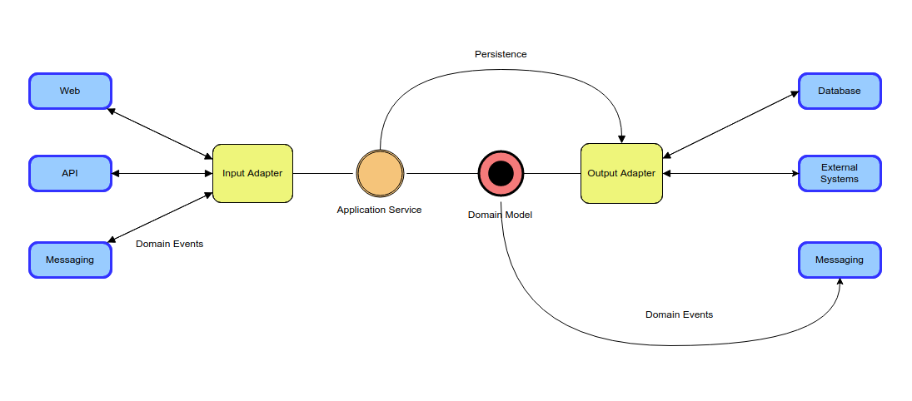

# Layered Architecture

This architecture is based on the Hexagonal Architecture (Ports and Adaptors).To support the separation of concerns, there are layers to express the different responsibilities of an application. 

## The Domain Layer

At the heart of the architecture is the domain layer containing all the logic specific to the business, no other concern is included. Domain logic is therefore protected and not exposed to the external world.

## The Application Service Layer

The application service layer represents the use cases and behavior at the application level. This layer acts as a coordinator between the domain and the infrastructure layers. It communicates with technical and infrastructural concerns only through well defined interfaces. 

## The Infrastructural Layers

These layers (not necessarily stacked on top of each other) are the technical details that enable it to function. They are concerned with purely technical capabilities, such as presentation (whether external systems or humans), storing the state of domain objects. In addition, the infrastructural layer can provide capabilities for logging, security, notification, and integration with external applications.

## Presentation concerns

In this diagram, the presentation concerns is the only one that communicates directly with the application service layer, without using an explicit interface. This is because the presentation is the client layer of the application service and therefore the application service layer doesn't know the existence of a presentation, which means it will never try to communicate with the presentation. 

## Dependency Inversion

To enforce a separation of concerns, the domain layer and application layers at the center of the architecture should not depend on any other layers. 

* All dependencies face inward.
* The domain layer does not depend on anything else.
* The application layer is dependent only on the domain layer.
* The application layer defines interfaces that enable domain objects to be hydrated and persisted.
* The infrastructural layers then implement and adapt to these
interfaces.

## Communication Across Layers

When communicating across layers, to prevent exposing the details of the domain model to the outside world, never pass domain objects across boundaries. Instead, use simple data transfer objects (DTOs), presentation models (view models), and application event objects to communicate changes or actions in the domain.

